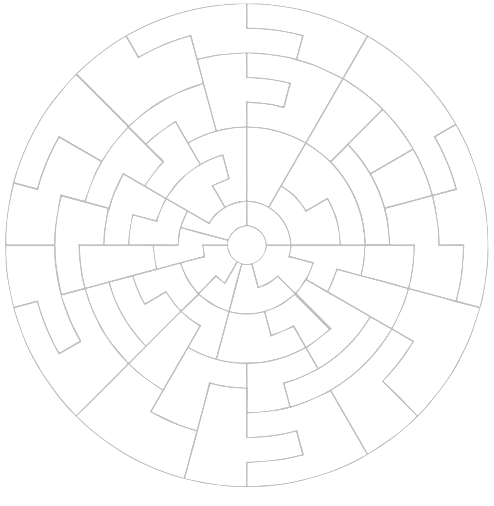

```js
import {twoDayPlanetAttack} from "./components/planet_history.js";
```

<style>

.hero {
  display: flex;
  flex-direction: column;
  align-items: center;
  font-family: var(--sans-serif);
  margin: 1rem 0 2rem;
  text-wrap: balance;
  text-align: center;
}

.hero h1 {
  margin: 2rem 0;
  max-width: none;
  font-size: 14vw;
  font-weight: 900;
  line-height: 1;
  background: linear-gradient(30deg, var(--theme-foreground-focus), currentColor);
  -webkit-background-clip: text;
  -webkit-text-fill-color: transparent;
  background-clip: text;
}

.hero h2 {
  margin: 0;
  max-width: 34em;
  font-size: 20px;
  font-style: initial;
  font-weight: 500;
  line-height: 1.5;
  color: var(--theme-foreground-muted);
}

@media (min-width: 640px) {
  .hero h1 {
    font-size: 90px;
  }
}

.card h2 {
  font-size: 32px;
  text-align:justify;
}

#map-container {
  position:relative;
}

#map {
  position: absolute;
  pointer-events: none;
  object-fit:cover;
  width: calc(100% - 2rem)
}

#map img {
  margin-top:1rem;
}

</style>


```js
const lang = view(Inputs.select(["es", "fr", "de", "en", "it", "pl", "ru"], {value: "en", label: "Language", width: '4em'}))
```

<div class="hero">
  <h1>Helldivers Dashboard </h1>
  <h2>Welcome Helldiver!</h2>
</div>

<div class="warning" label="Watch out, Helldiver">
This page does not auto-update and the underlying data is collected every 10 minutes. You need to manually refresh for the latest version.
Thanks for understanding as we try and minimize server impact.
</div>

```js
const status = FileAttachment('./data/helldivers.json').json();
const agg = FileAttachment('./data/aggregates.json').json();
const focus = FileAttachment('./data/recent_attacks.json').json();
function getColor(owner) {
  switch(owner){
    case 'Terminids':
      return '#EF8E20';
      case 'Automaton':
        return '#EF2020';
      case 'Humans':
        return '#79E0FF';
  }
}
function factionLegend(factions, {r = 5, strokeWidth = 2.5, width=640} = {}) {
  const frameAnchor = 'top-right';
  const factionMarks = factions.map((v,i) => {
      return [
        Plot.dot([v], {
          r: r,
          strokeWidth: strokeWidth,
          fill: getColor(v),
          stroke: getColor(v),
          frameAnchor,
          dx: (-6*16) - (r+strokeWidth),
          dy: 3*i*r,
        }),
        Plot.text([v], {
          text: [v],
          dx: -4*16,
          dy: 3*i*r-6,
          frameAnchor,
          textAnchor: 'middle',
        }),
      ]
    });
    let arrowMarks = [
      Plot.arrow(['Attack'],{ 
      x1:73, 
      x2:78,
      y1:88,
      y2:88,
      bend: true,
    }), Plot.text(['Attack'],{
      frameAnchor,
      text: ['Attack'],
      textAnchor: 'middle',
      dx: -4*16,
      dy: 9*r-6
    })];

  return Plot.marks(factionMarks.concat(arrowMarks));
}
```

```js
const active = status.campaigns.map(p => p.planet.index)
active.push(0);
```

<div class="card">
${
  Inputs.table(status.global_events, {
    header: {title: "Title", message: "Message"}, 
    columns:['title', 'message'],
    format: { message: x => htl.html`<span style="white-space:normal">${x[lang]}`},
    layout: 'auto',
    }
  )
}
</div>

<div class="grid grid-cols-4">
  <div id="map-container" class="card grid-colspan-2 grid-rowspan-2">
    <div id="map">
    <h2>&nbsp;</h2>
    
    </div>
    <div>${resize((width) => Plot.plot({
        width: width,
        title: "The Galactic War",
        aspectRatio: 1,
        height: width,
        projection: {type: "reflect-y", domain: {type: "MultiPoint", coordinates: [[100,-100],[100,100],[-100,100],[-100,-100]]}},
        marks: [
          Plot.dot(status.planet_status, {
            x: p => p.planet.position.x,
            y: p => p.planet.position.y, 
            r: width/150, 
            stroke: p => getColor(p.planet.initial_owner),
            fill: p => getColor(p.owner), 
            strokeWidth: width/220,
            opacity: p => (active.includes(p.planet.index) ? 1.0 : 0.6),
          }),
          Plot.arrow(status.planet_attacks, {
            x1: p => p.source.position.x,
            y1: p => p.source.position.y,
            x2: p => p.target.position.x,
            y2: p => p.target.position.y,
            bend: true,
            inset: width/220,
            strokeWidth: width/440,
          }),
          Plot.rect(status.planet_attacks, {
            x1: p => p.target.position.x-(width/440),
            y1: p => p.target.position.y-(width/220),
            x2: p => p.target.position.x+(width/440),
            y2: p => p.target.position.y-(width/220)+1,
            stroke: "black",
            fill: p => getColor(status.planet_status[p.target.index].owner)
          }),
          Plot.rect(status.planet_attacks, {
            x1: p => p.target.position.x-(width/440),
            y1: p => p.target.position.y-(width/220),
            x2: p => (p.target.position.x-(width/440))+((width/220)*(status.planet_status[p.target.index].liberation/100)),
            y2: p => p.target.position.y-(width/220)+1,
            stroke: "black",
            fill: p => getColor(status.planet_status[p.source.index].owner)
          }),
          Plot.tip(status.planet_status, Plot.pointer({
            x: p => p.planet.position.x, 
            y: p => p.planet.position.y,
            title: p => [`${p.planet.name}\n`, `Liberation: ${p.liberation.toFixed(2)}%`, `Players: ${p.players}`].join("\n"), fontSize: 20})
          ),
          factionLegend(['Humans', 'Terminids', 'Automaton'], {r:width/150, strokeWidth:width/220, width}),
        ],
        tip: true,
      }))
    }</div>
  </div>
  <div class="card grid-colspan-2" style="padding:1rem;">${resize((width) => 
    twoDayPlanetAttack(width, agg, focus[0][0], status.planet_status[focus[0][0]].planet.name))
  }</div>
<div class="card grid-colspan-2">${resize((width) => twoDayPlanetAttack(width, agg, focus[1][0], status.planet_status[focus[1][0]].planet.name))}</div>
<div class="card grid-colspan-2">${resize((width) => twoDayPlanetAttack(width, agg, focus[2][0], status.planet_status[focus[2][0]].planet.name))}</div>
<div class="card grid-colspan-2">${resize((width) => twoDayPlanetAttack(width, agg, focus[3][0], status.planet_status[focus[3][0]].planet.name))}</div>
</div>

## History

```js
const v1 = x => x.players;
const v2 = x => x.impact;
const y2 = d3.scaleLinear(d3.extent(agg, v2), [0, d3.max(agg, v1)]);
```

### Player History

<div class="grid grid-cols-1">
  <div class="card">${
    resize((width) => Plot.plot({
      width:width,
      x: {domain:[new Date(Date.now() - (60_000*60*24*7)), Date.now()]},
      y: {axis: "left", label: "Players"},
      marks: [
        Plot.axisY(y2.ticks(), {color:"steelblue", anchor:"right", label: "Impact Multiplier", y: y2, tickFormat: y2.tickFormat()}),
        Plot.ruleY([0]),
        Plot.lineY(agg, {x: "timestamp", y: "players", tip:"x", stroke: "red", strokeWidth: 4}),
        Plot.lineY(agg, Plot.mapY(D => D.map(y2), {x: "timestamp", y: "impact", stroke: "steelblue"}))
      ]
    }))
  }</div>
</div>


